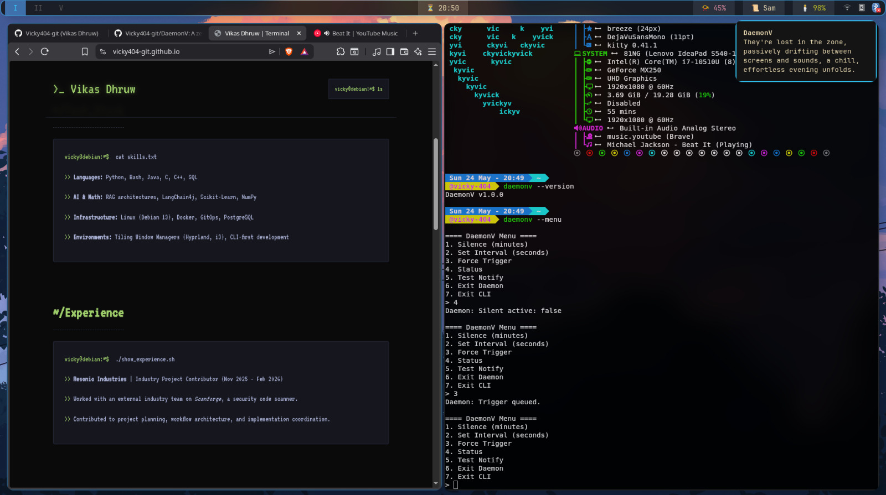

# 🧠 DaemonV

> An ambient machine-consciousness daemon for Linux and Windows that quietly observes your digital behavior and comments on it using AI.

DaemonV is a lightweight context-aware background daemon written in Java.

It quietly runs in the background,
checks the time,
observes what you're doing,
and occasionally reacts.

Sometimes it gives atmosphere.

Sometimes philosophy.

Sometimes it roasts you for wasting 3 hours on YouTube at 2 AM.

No GUI.
No bloat.
Pure Java.
Zero dependencies.

# 
*DaemonV passively monitoring a i3 workspace and delivering a contextual AI observation.*
* At top right the notifications pops up
* At rightside you can see terminal and DaemonV commands
---

# ✨ Features

* Context-aware AI observations via Groq (Llama 3.1)
* Detects:

  * idle time
  * active windows
  * audio playback
  * terminal activity
* 4 behavioral states:

  * `FOCUSED`
  * `DISTRACTED`
  * `PASSIVE`
  * `IDLE`
* Different AI personalities for each state
* Native Linux + Windows notifications
* Silent scheduling system
* Lightweight TCP remote control server
* CSV event logging with automatic rotation
* Very low memory usage
* Cross-platform support

---

# 🧠 Example Outputs

> “The terminal glows like a furnace tonight.”

> “Another Reddit tab. Another hour dissolved.”

> “You opened YouTube ‘for one video.’”

> “The world is asleep. Your screen is the only sun.”

---

# ⚙️ How It Works

DaemonV wakes up every few hours and checks:

* current time
* idle duration
* active application
* audio state

It classifies your current behavior and generates a short contextual observation using AI.

The daemon then returns to sleep.

Single loop.
No overengineering.

---

# 🧩 Behavior States

| State        | Meaning                          |
| ------------ | -------------------------------- |
| `FOCUSED`    | Coding / terminal work           |
| `DISTRACTED` | Doomscrolling / passive browsing |
| `PASSIVE`    | Music or passive media           |
| `IDLE`       | User absent                      |

Each state changes:

* AI tone
* personality
* generated message style

---

# 🛰 Remote Control

DaemonV exposes a lightweight socket server on:

```text
localhost:9333
```

Supported commands:

```text
STATUS
SILENT <minutes>
SCHEDULE <start> <end>
INTERVAL <seconds>
TRIGGER
NOTIFY <message>
EXIT
```

---

# 📊 Logging

All events are stored locally in:

```text
dataset.csv
```

Stored data:

* timestamp
* idle duration
* active window
* behavior state
* generated message

---

# 🚀 Installation

## Requirements

### Linux

* Java 17+
* `xdotool`
* `notify-send`
* `xprintidle`
* `pactl` or `wpctl`

### Windows

* Java 17+
* PowerShell

---

# 🔑 Setup

Create `.env`:

```env
GROQ_API_KEY=gsk_your_key_here
```

Get a free API key:

https://console.groq.com

---

# 🏃 Running

## Production

```bash
java -jar DaemonV.jar
```

## Debug

```bash
java -jar DaemonV.jar --debug
```

---

# 🧪 CLI Flags

| Flag                 | Description              |
| -------------------- | ------------------------ |
| `--menu`             | Open remote control menu |
| `--debug`            | Run with 5s intervals    |
| `--ask`              | Force immediate trigger  |
| `--silent <minutes>` | Temporary silent mode    |

---

# 🛣 Roadmap

## v0.4

* Native OS idle hooks
* Better Wayland support
* Improved process detection

## v0.5

* Ollama integration
* Offline AI support
* Local models

## Future

* Plugin system
* Behavioral memory
* Adaptive personalities

---

# ⚠ Disclaimer

DaemonV is not:

* a productivity app
* a virtual assistant
* a Jarvis clone
* an automation framework

It exists purely for:

* atmosphere
* presence
* contextual commentary
* ambient machine behavior

A small machine spirit living quietly beside your workflow.

